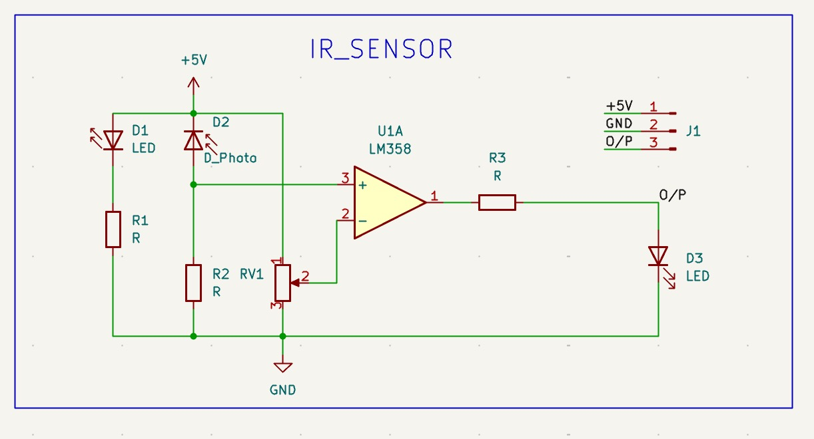
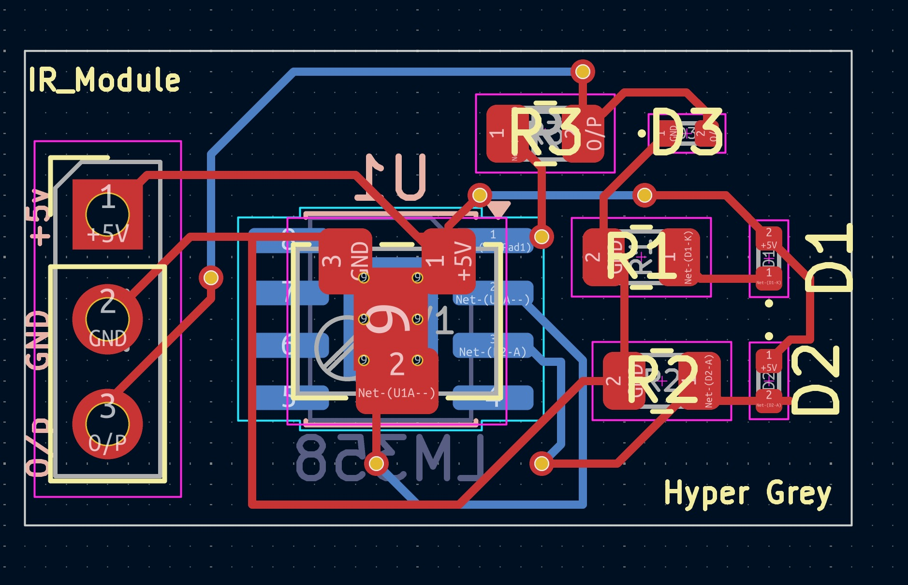
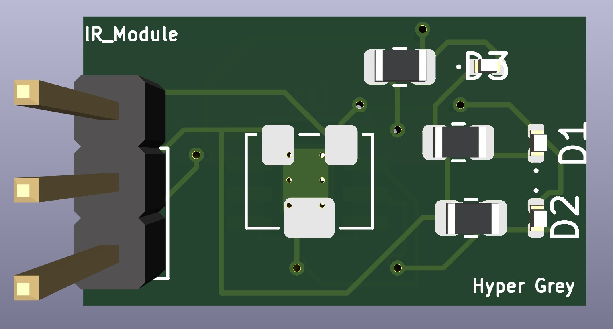
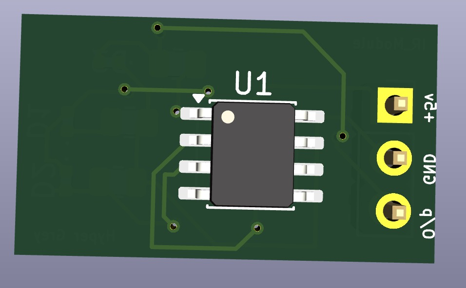

# IR Sensor Module PCB 
**KiCad Hardware • Learning Project**

A learning-oriented PCB design of an infrared (IR) sensor module created while exploring schematic design, PCB routing fundamentals, and KiCad hardware workflows.

---

## Preview

### Schematic

### PCB Layout

### 3D View (Front)

### 3D View (Back)

---

## Features
- Infrared sensor based detection module
- Compact PCB layout design
- Clean routing and grounding approach
- Designed and routed using KiCad
- Beginner-friendly hardware learning project

---

## Project Structure
hardware/
├── IR_Sensor.kicad_sch
├── IR_Sensor.kicad_pcb
└── IR_Sensor.kicad_pro

Images/
├── pcb.png
├── pcb_3d_fv.png
├── pcb_3d_bv.png
└── schematic.png

---

## Learning Goals
This project focuses on:

- Understanding IR sensor module design
- Basic PCB routing practices
- Component placement strategies
- KiCad schematic and PCB workflow

---

##  Tools Used
- KiCad (Schematic + PCB Layout)
- KiCad 3D Viewer

---

## Future Improvements
- Add mounting holes and board labeling
- Improve silkscreen readability
- Optimize trace widths and spacing
